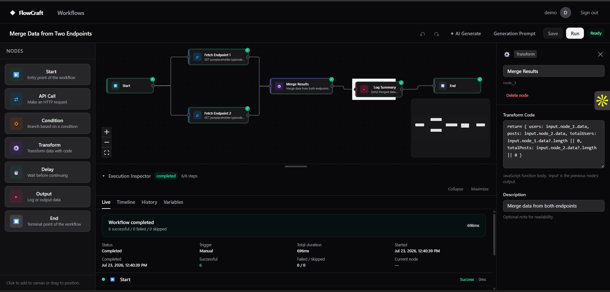
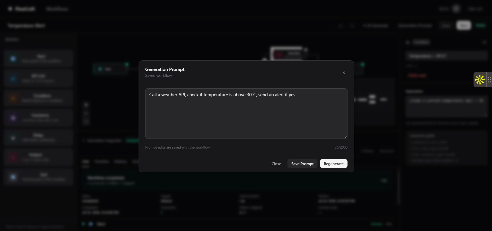
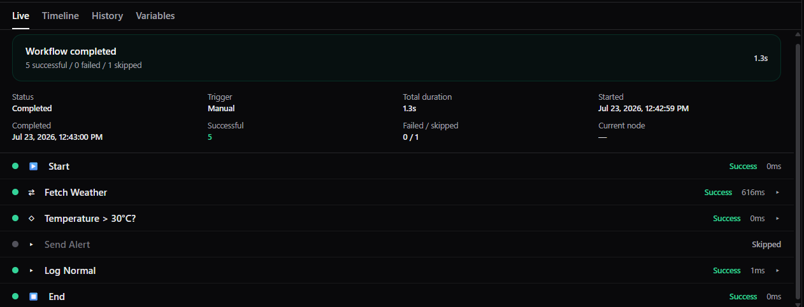
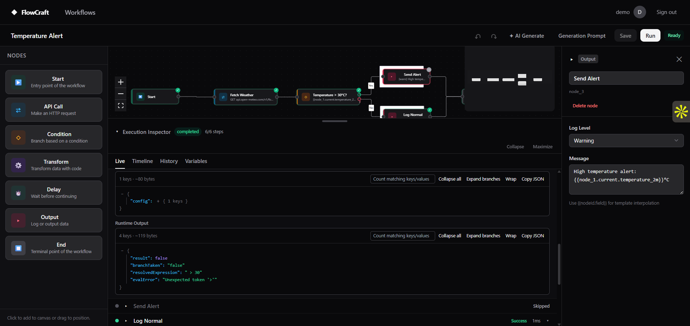
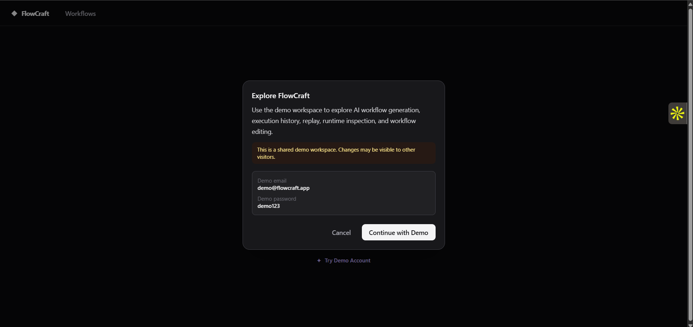
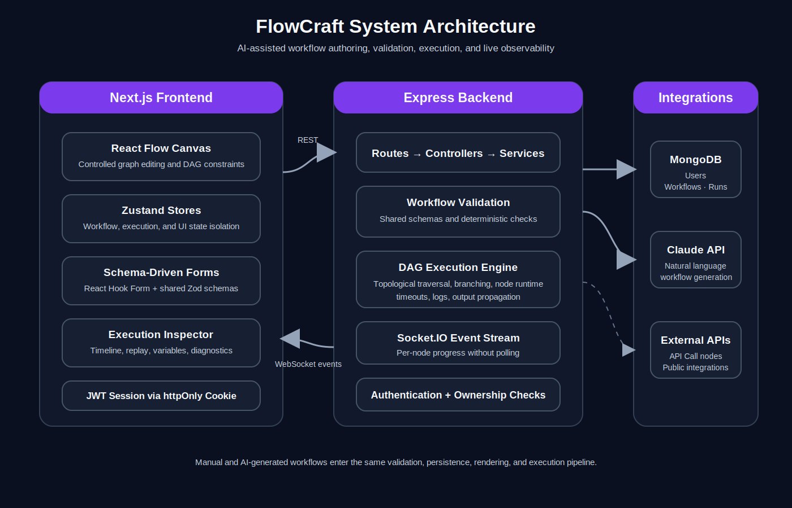
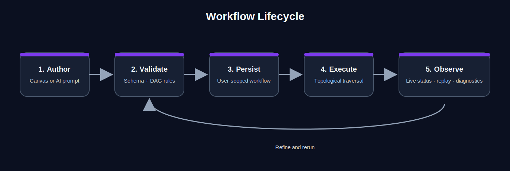
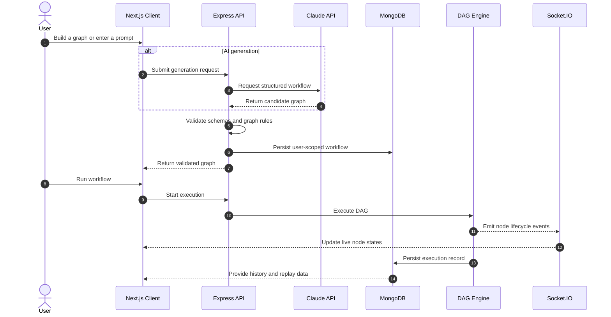

<div align="center">

# FlowCraft

### AI-powered visual workflow builder for designing, validating, and executing real-time automation graphs

[](https://flowcraft-ai-workflow-builder.vercel.app/)
[](https://nextjs.org/)
[](https://www.typescriptlang.org/)
[](https://reactflow.dev/)
[](https://socket.io/)
[](https://www.mongodb.com/)

**Build workflows visually. Generate them with AI. Execute them with live, node-level observability.**

</div>

---



<p align="center">
  <sub><strong>Figure 1.</strong> A completed multi-endpoint workflow with parallel API calls, data transformation, live execution status, and node-level configuration.</sub>
</p>

## Overview

FlowCraft is a full-stack visual workflow platform where users create directed automation graphs, configure typed nodes, generate workflows from natural-language prompts, and inspect executions in real time.

The project focuses on engineering problems that go beyond a traditional CRUD application:

- controlled graph editing and validation
- deterministic DAG execution
- real-time execution streaming
- AI output validation
- user-scoped authentication and persistence
- replay, payload inspection, and runtime diagnostics
- production deployment across independent frontend and backend services

Manual and AI-generated workflows use the same graph model, validation rules, persistence layer, canvas, and execution engine.

## Live Demo

**Application:**  
https://flowcraft-ai-workflow-builder.vercel.app/

### Demo credentials

| Field | Value |
|---|---|
| Email | `demo@flowcraft.app` |
| Password | `demo123` |

The demo account is a shared workspace. Changes may be visible to other visitors, and its password cannot be changed.

## Product Walkthrough

### AI-assisted workflow generation



<p align="center">
  <sub><strong>Figure 2.</strong> A saved natural-language generation prompt that can be edited and used to regenerate the workflow.</sub>
</p>

FlowCraft uses the Anthropic Claude API to translate natural-language requirements into editable workflow graphs.

Generated workflows are not trusted automatically. They pass through:

- shared Zod schemas
- required-capability checks
- graph and connection validation
- deterministic consistency rules
- prompt-fidelity verification
- atomic replacement only after validation succeeds

### Real-time workflow execution



<p align="center">
  <sub><strong>Figure 3.</strong> A conditional workflow execution showing successful nodes, a skipped branch, total duration, and per-node timing.</sub>
</p>

The execution engine supports:

- topological graph traversal
- conditional branching
- skipped-path handling
- asynchronous API calls
- transform and output nodes
- input and output propagation
- per-node status, duration, and logs
- persisted execution history

Socket.IO streams execution events directly to the client, allowing node states to update without polling.

### Execution inspector and runtime diagnostics



<p align="center">
  <sub><strong>Figure 4.</strong> The execution inspector exposing runtime output, branch resolution, JSON payloads, and diagnostic details.</sub>
</p>

The inspector provides:

- live execution state
- execution history
- timeline navigation
- variables and payload inspection
- expandable JSON branches
- search across keys and values
- execution replay
- node focusing
- human-readable failure guidance
- technical error details for debugging

Large payloads use bounded and virtualized rendering patterns so the interface does not attempt to render the full JSON tree at once.

### Public demo onboarding



<p align="center">
  <sub><strong>Figure 5.</strong> Public demo onboarding with shared credentials and a clear workspace warning.</sub>
</p>

The demo account follows the standard authentication flow rather than bypassing application security. Server-side restrictions prevent the shared account from changing its password.

## Core Capabilities

### Visual workflow authoring

- Drag-and-drop React Flow canvas
- Controlled nodes and edges
- Panning, zooming, selection, and connection editing
- Type-specific node configuration
- Graph connection constraints
- Undo and redo support
- Persistent workflow metadata and generation prompts

### Workflow node types

| Node | Responsibility |
|---|---|
| Start | Defines the workflow entry point |
| API Call | Executes an HTTP request |
| Condition | Routes execution through true or false branches |
| Transform | Processes data with configurable logic |
| Delay | Pauses execution for a defined period |
| Output | Logs or exposes workflow results |
| End | Marks a terminal workflow path |

### AI generation

- Natural-language graph generation
- Configurable Anthropic model
- Prompt persistence and regeneration
- Prompt-fidelity validation
- Required-capability detection
- Human-readable validation feedback
- Deterministic endpoint consistency checks
- Protection against malformed or incomplete graphs

### Real-time observability

- Socket.IO execution events
- Running, Success, Failed, and Skipped states
- Execution timeline
- Replay and node focus
- Variables and payload inspection
- Execution insights
- Searchable and expandable JSON
- No client polling

### Authentication and security

- JWT-based sessions
- Secure httpOnly cookies
- User-scoped workflow ownership
- Password hashing with bcrypt
- Authenticated password changes
- Current-password verification
- Demo-account password restrictions
- Rate limiting for password-change attempts

## Architecture



<p align="center">
  <sub><strong>Figure 6.</strong> FlowCraft system architecture.</sub>
</p>

The Next.js frontend owns graph interaction and execution visualization. The Express backend owns authentication, validation, persistence, AI orchestration, and DAG execution. MongoDB stores users, workflows, and execution history, while Socket.IO streams runtime events to the browser.

### Shared workflow pipeline



<p align="center">
  <sub><strong>Figure 7.</strong> Manual and AI-generated workflows use one shared validation and execution lifecycle.</sub>
</p>



## State Management

FlowCraft separates client state by domain rather than placing the entire application into a single global store.

| Store | Responsibility | Persisted |
|---|---|---:|
| `workflowStore` | Nodes, edges, workflow metadata, and editing operations | Yes |
| `executionStore` | Active execution, node states, logs, and replay | No |
| `uiStore` | Selection, panels, layout, and inspector state | No |

This reduces prop drilling, isolates transient execution state, and keeps graph persistence independent from temporary interface behavior.

## Engineering Challenges

### Maintaining one canonical graph

The React Flow canvas is controlled by application state. Rendering, graph updates, persistence, validation, and execution all operate on one canonical graph representation.

### Treating AI output as untrusted input

Claude output is validated before it reaches the active workflow. Generated nodes and edges must satisfy the same rules as manually created workflows.

### Streaming execution without polling

The server emits node-level events through Socket.IO. The frontend updates progress as each node runs and later retrieves persisted history for replay.

### Cross-origin production deployment

The production system coordinates:

- Vercel frontend hosting
- Railway backend hosting
- CORS and trusted origins
- secure cookie behavior
- REST API routing
- direct Socket.IO browser connections

### Inspecting large runtime payloads

The JSON viewer supports bounded rendering, branch expansion, search, redaction, and metadata without forcing the browser to render every nested value immediately.

## Technology Stack

| Area | Technology |
|---|---|
| Frontend | Next.js 14, React, TypeScript |
| Visual graph | React Flow |
| State management | Zustand |
| Forms and validation | React Hook Form, Zod |
| Backend | Node.js, Express, TypeScript |
| Database | MongoDB, Mongoose |
| Real-time communication | Socket.IO |
| Authentication | JWT, secure httpOnly cookies, bcrypt |
| AI | Anthropic Claude API |
| Testing | Vitest, React Testing Library |
| Deployment | Vercel and Railway |

## Testing and Verification

Automated tests cover:

- authentication and session behavior
- demo-account normalization and restrictions
- password-change validation and rate limiting
- workflow schemas and graph consistency
- endpoint contradiction detection
- AI generation validation
- client API and auth-store behavior
- execution regressions
- account-security accessibility and forms

The project currently includes **41+ automated tests**, with additional targeted regression coverage added as new execution and AI-validation cases are identified.

## Getting Started

### Prerequisites

- Node.js
- npm
- MongoDB connection string
- Anthropic API key for AI generation

### Backend

```bash
cd server
cp .env.example .env
npm install
npm run dev
```

### Frontend

```bash
cd client
npm install
npm run dev
```

The frontend and backend run as separate services during local development.

## Environment Variables

```env
PORT=3001
MONGODB_URI=your_mongodb_connection_string
CLIENT_URL=http://localhost:3000
JWT_SECRET=replace_with_a_strong_secret
ANTHROPIC_API_KEY=your_anthropic_api_key
DEMO_ACCOUNT_EMAIL=demo@flowcraft.app
```

Production browser configuration:

```env
NEXT_PUBLIC_API_URL=https://your-backend-service.example.com
NEXT_PUBLIC_SOCKET_URL=https://your-backend-service.example.com
TRUSTED_ORIGINS=https://your-frontend.example.com
```

`NEXT_PUBLIC_*` values are embedded into the browser bundle at build time. Updating them requires a new frontend deployment.

## API Overview

| Method | Endpoint | Purpose |
|---|---|---|
| `POST` | `/api/auth/register` | Create an account |
| `POST` | `/api/auth/login` | Start an authenticated session |
| `GET` | `/api/auth/me` | Return the authenticated user |
| `POST` | `/api/auth/change-password` | Change the current password |
| `GET` | `/api/workflows` | List the current user’s workflows |
| `POST` | `/api/workflows` | Create a workflow |
| `POST` | `/api/executions/:id/run` | Execute a workflow |
| `POST` | `/api/ai/generate` | Generate and validate a workflow |

## Demo Workspace Safety

FlowCraft does not seed or reset production data automatically.

- Keep the demo account unprivileged.
- Use only public sample workflows.
- Never store private API keys or authorization headers.
- Do not include personal information.
- Expect edits to be visible to other demo visitors.
- Verify demo behavior in an Incognito window before sharing the application.

## Current Limitations

- The demo workspace is shared and does not reset automatically.
- Existing sessions remain active after a password change.
- Password-change rate limiting is process-local.
- Transform execution is not yet isolated in a dedicated sandbox.
- Multi-user collaborative editing is not currently supported.

## Roadmap

- Parallel execution for independent DAG branches
- Workflow versioning and comparison
- Scheduled and recurring executions
- Sandboxed transform execution
- Reusable workflow templates
- Team workspaces
- Role-based access control
- Collaborative editing
- Expanded execution analytics

## What FlowCraft Demonstrates

FlowCraft demonstrates end-to-end ownership of a non-trivial software product:

- advanced React and TypeScript architecture
- controlled visual graph editing
- DAG modeling and execution
- real-time communication and observability
- authentication and authorization
- AI integration with validation boundaries
- performance-conscious JSON inspection
- automated testing
- production deployment

---

<div align="center">

### Explore FlowCraft

[**Open the live application →**](https://flowcraft-ai-workflow-builder.vercel.app/)

`demo@flowcraft.app` · `demo123`

</div>
